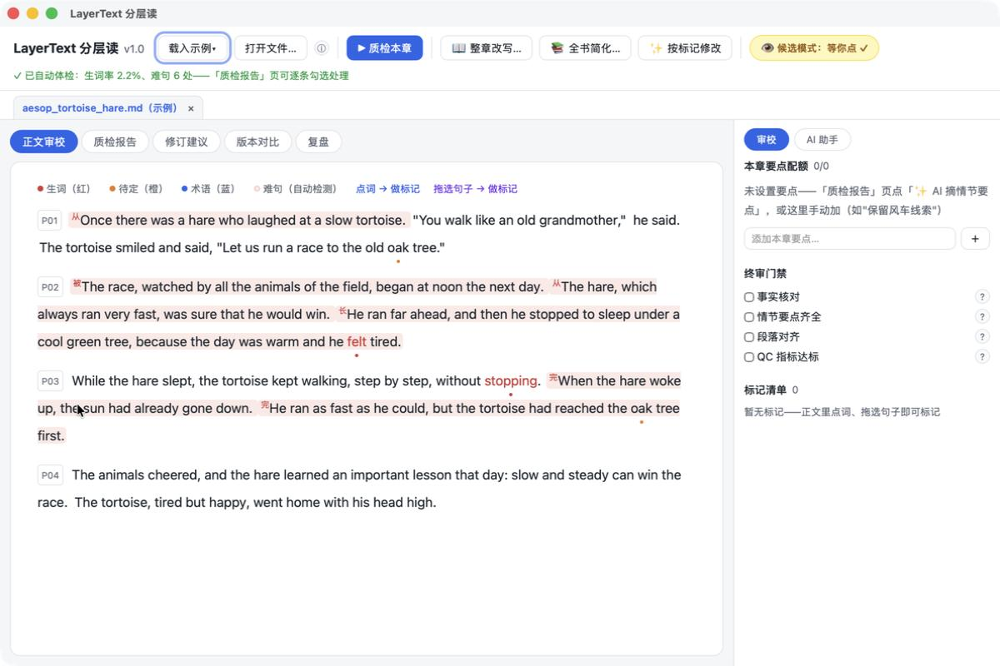
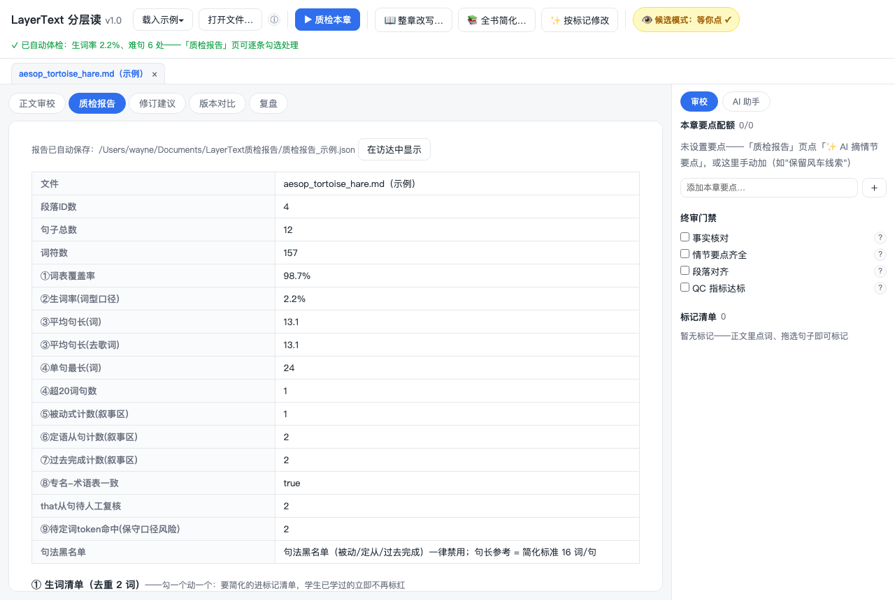
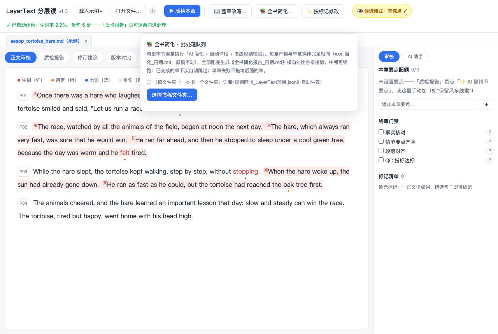

# LayerText 分层读

**英语文本简化与审校工作台** — 把"一篇英文原著简化成学生能读的版本"
从混乱的手工流程，变成有质检、有人机协作审校、全程可审计的桌面工具。

> LayerText (分层读) turns "simplifying an English book for my students"
> from a messy manual process into a tool with automated quality checks, human-in-the-loop
> review, and a full audit trail.

**给谁用**：把英文原著/分级文本简化给自己学生读的英语教师。全离线、数据本地存储、零遥测。

**难度观**：不预设 B/M/A 难度层——难度由你的**词库**锚定（学生学过什么词，就简化到词库内），
唯一的硬标准是句长上限（默认 16 词，可调）。需要更简的版本？把简化结果再导入、再简化一遍即可。

## 核心工作流

```
导入原文（.txt/.md/.docx，自动转章节格式，打开即自动体检）
   → 配词库（内置课标2022三级1600词 ∪ 教材已学词CSV ∪ 术语表——难度由此锚定）
   → 初步诊断（自动体检：生词/句法风险逐条可勾选处理；AI 摘情节要点预填配额）
   → AI 简化本章（整章逐段改写，句长上限可调；要更简=再导入再简化）
      ↳ 或 📚 全书简化：整本书排队跑「简化+体检+规则校验」，书级汇总报告，中断可续跑
   → 审校工作台（点词划句标记，AI 只出候选、教师握定稿权）
   → 待确认队列（机器筛出来的汇成一张表：★正本词消失 / 未支持难词 / 引擎客观项；
        每条给"词 · 出处句 · 中文候选"，三个键：①补注 ②换成 X ③忽略）
   → 标记执行（修订对照表 → 确认 → 批量应用，每处留痕）
   → 版本与审计（变更日志 CSV、版本 diff）
   → 导出（md/docx 含章末词句卡）
```

**两个新机制（2026-09-13）**：[待确认队列与校准台账](docs/待确认队列与校准台账.md)——
①**待确认队列**把三路机器结论合成教师只需要点的一张表（原先要开两个视图、对两份 JSON）；
②**校准台账**是 append-only 的不可变正本：教师点过的校准按「书/章/层/词」重放到**当前这一版**，
修的是"我点了确认，下次进来校准怎么没了"（标记文件按文件名落盘，管线一换版本名就读到了空表）。
三个键的传播口径各不相同：①补注向下传播、②换成 X 只写下级待办、③忽略**只在当前层生效**；
②里教师亲手填的替换词**不再经过 AI**（人定的东西不能被机器覆盖）。

## 当前状态：v1.2.1 ✅

| 能力        | 说明                                                                                                                                                                                                                                            |
| ----------- | ----------------------------------------------------------------------------------------------------------------------------------------------------------------------------------------------------------------------------------------------- |
| 任意导入    | .md / .txt / **.docx**（Word 直接打开自动转章节格式），打开即**自动体检**                                                                                                                                                                       |
| 初步诊断    | 生词/句法风险逐条**勾选处理**（要简化→标记清单 / 已学过→入词库）；生词带 **zipf 词频分诊**（wordfreq 纯离线：高频未收=⚠疑似漏收置顶，勾了才入库）；AI 摘情节要点预填配额                                                                        |
| 自动体检    | 生词率/覆盖率/句长/被动/定从/过去完成/专名一致性 + OOV 清单，报告自动落盘                                                                                                                                                                       |
| 审校工作台  | 三态高亮正文、点词/拖选标记（7+8 类）、要点配额、终审门禁、标记清单跳转                                                                                                                                                                         |
| 待确认队列  | 机器筛出的三路结论汇成一张表（★正本词消失 / 未支持难词 / 引擎客观项），每条给"词·出处句·中文候选"，三个键：①补注 ②换成 X ③忽略；侧栏常驻「待确认 N 条 ▸ 去看」，打开一章就看得见                                                                |
| 校准台账    | 教师点过的校准进 append-only 正本（`human`/`ai` 来源分得开），换一版产物照样**重放回来**——修"点了确认下次进来就没了"                                                                                                                            |
| AI 简化本章 | 整章逐段改写（方向指令+词库边界+黑名单约束，句长上限可调；**无预设难度**——要更简版本：结果再导入再简化），完成后自动体检                                                                                                                        |
| 全书批处理  | 📚 选书稿文件夹勾选章节→队列自动「AI 简化+体检+规则校验」→每章产物+**书级汇总报告**（生词率/句长/黑名单/规则残留/耗时/tokens 横向表）；**中断可续跑**，一本书压进一晚                                                                           |
| AI 修订候选 | 标记→建议（对话/批量/逐句）→**正文行内对照**→点 ✓ 采纳（原稿不覆盖，工作稿+变更日志留痕）                                                                                                                                                       |
| AI 助手     | 右侧流式对话，AI 调用本地工具（跑体检/查句子/提候选），每条建议经引擎复核                                                                                                                                                                       |
| 辅助模型    | **可选**（默认关）：本机小模型（oMLX / Ollama 等 OpenAI 兼容端点）跑"短输入、任务单一、结果可机检"的映射类小活——词→课标内简单词、短语→中文注释，**不花 API 钱**；整章简化 / 逐句改写 / 对话仍走主模型。失败或超限自动回主模型并把原因写在状态行 |
| 新手友好    | 首启动向导、四步导览、AI 服务商预设+Key 教程、错误人话化、简化标准可调、本书配置随文件夹                                                                                                                                                        |
| 导出        | Word 版（含章末词句卡）/ 朗读音频（系统语音）/ 标记 JSON / 变更日志 CSV                                                                                                                                                                         |
| 版本对比    | 双版本逐段 diff（原文 vs 简化版 vs 再简化版）                                                                                                                                                                                                   |

引擎质量：**938 项回归测试（937 通过 / 1 跳过）**（防坑规则 + 审校 DOM + UI 部件 + 应用逻辑 + 校准台账 / 待确认队列）；TS 引擎与 Python 原型在示例与真实章节上逐字段一致（[M1 对照报告](docs/M1-对照测试报告.md)）。
产品文档：[PRD（一页）](docs/PRD.md) · [CHANGELOG](CHANGELOG.md) · [待确认队列与校准台账](docs/待确认队列与校准台账.md) · [段级门禁与风险队列](docs/段级门禁与风险队列.md) · [工程化开发提示词](docs/工程化开发提示词_v1.0.md)。

**这个工具做的是什么**（定位，两个数分开看不合成）：LayerText 做的是**受控的分层阅读适配**——
**简化**管句法与词汇负荷、**加注**管即时理解支架。报告与界面分别显示
**阅读负荷下降**（生词率降幅）与**理解支架覆盖率**（该注的词注出多少）。
加注是给难词配拐杖、**不减少阅读负荷**；生词率降了**也不代表句子上更轻松**。
（真项目实测 · Animal Farm 第一章：**A 层**阅读负荷下降 28%、理解支架覆盖率 96%；
**M 层** 45% / 98%；**B 层** 55% / 93%——A 层几乎全是"加支架"而不是"降负荷"，
这个区别在合成指标里会被抹平。**这几个数是可复现的**：样本（真项目十章的原文与三层产物、词库/词典/专名表/知识库）
与结论**冻在仓库外**，用 `LAYERTEXT_REPLAY_DIR=<夹具目录>` 指过来，`tests/replay.test.ts`
每次都会重算并逐项对数；换台机器、换个日期，对数结果一样。
（夹具不随仓库分发——它含的是原书正文与教师自己的产物，不是这个工具的一部分；
没设这个变量时回放层整层跳过，不会假装通过。）

换一本书 / 失败后怎么续跑 / 报告里那些覆盖率各是什么：[换书与续跑说明](docs/换书与续跑说明.md) · 判定与人工队列：[段级门禁与风险队列](docs/段级门禁与风险队列.md) · 审查报告逐条落实与证据：[v3 落实对照表](docs/审查报告_落实对照表.md) · [v4 方向落实对照表](docs/v4方向_落实对照表.md)。

## 安装（macOS）

1. 下载 `LayerText_1.1.0_universal.dmg`（[Releases](../../releases) 页，或本地构建见下）；
2. 双击打开 dmg，把 **LayerText** 拖入"应用程序"文件夹；
3. 首次打开：**右键 → 打开 → 再点"打开"**（开源个人项目未做苹果签名公证，此提示属正常）。

本地构建 dmg：

```bash
npm install && cd app && npm install
npm run tauri build --target universal-apple-darwin
# 产物：app/src-tauri/target/universal-apple-darwin/release/bundle/dmg/*.dmg
```

## 图形界面

打开应用后两步上手：

1. 点 **「载入示例」**（或"打开章节文件…"选择自己的 md/txt/docx）——打开即**自动体检**；
2. 切到 **「质检报告」** 页：生词、难句逐条列出、每条可勾选处理（要简化/已学过/要改），
   还能让 AI 摘情节要点；再切 **「正文」** 页看三态高亮：词表外（红点）/待定词（橙点）/术语（蓝点），
   风险句淡红底并带「被/从/完/长」角标，点词/拖选句子即可标记。







> 截图使用内置 CC0 示例《龟兔赛跑》拍摄，不含任何真实学生数据。

报告自动落盘：文件模式存到源文件同目录，示例模式存到 `文稿/LayerText质检报告/`。

## 命令行（CLI）

```bash
git clone https://github.com/<your-org>/layertext.git
cd layertext
npm install
  npm test        # 92 项回归测试（防坑规则 + 审校 DOM + UI 部件 + 应用逻辑 + MCP 工具层）
npm run eval    # 金标准评测：黑名单命中率/OOV 对齐 vs 质量基线（低于基线退出码 1）

# 对示例文本跑一次质检（报告自动落盘到文本同目录）
node dist/src/cli.js qc examples/texts/aesop_tortoise_hare.md --tier M

# 使用自定义教材词库
node dist/src/cli.js qc examples/texts/school_story_club.md \
  --vocab examples/vocab/sample_teaching_vocab.csv
```

## MCP 服务（把质检引擎接进任何 AI 客户端）

`npm run mcp` 启动一个 stdio MCP 服务器（Claude Desktop / ZCode / Cursor 可直接挂），
暴露 4 个本地工具：`layer_qc`（全文体检）、`layer_word_status`（这个词学生学过吗）、
`layer_sentence_risks`（句法黑名单逐句检测）、`layer_check_revision`（AI 改完英文自查被动/定从/
超长残留）。口径与桌面应用同一套引擎，零遥测、不落盘。配置示例见 [docs/MCP.md](docs/MCP.md)。

## QC 指标：为什么这些句法是"黑名单"

被动语态、定语从句、过去完成时按初中教学进度属于未学/后学结构，出现即计为风险；
引语豁免、假阳性豁免、词形还原等防坑规则的完整说明见
[docs/QC指标说明.md](docs/QC指标说明.md)。

## 示例数据与版权

- `examples/texts/` 与 `examples/evals/`（金标准评测集）全部为本项目**自写文本（CC0）**，
  含一个刻意覆盖全部防坑规则的 [torture test](examples/texts/qc_torture_test.md)；
- 内置词表来自《义务教育英语课程标准（2022年版）》三级词汇表存档
  （`assets/wordlists/`，由 `tools/convert_wordlist.py` 展开为纯文本格式；
  存档缺失的数词/星期/月份等基础词由 `curriculum_2022_amendment.txt` 补录，见 W1 交付报告）；
- 自定义词库 CSV 格式样例：`examples/vocab/sample_teaching_vocab.csv`。

## 仓库结构

```
src/core/    QC 引擎（纯 TypeScript，无框架依赖：irregular / lexicon / textpipe / qc / risks / adoption / aiops）
src/cli.ts   命令行入口　　src/eval.ts   评测入口（npm run eval）
app/         macOS 桌面应用（Tauri 2：前端 Vite + 主进程 Rust，复用 src/core）
tests/       回归测试（node:test，938 项）
tools/       qc_chapter_ref.py（Python 参照版）、compare.ts（对照测试）、adoption.ts（采纳率分析）、extract_changelog.mjs（发布）
             af_pipeline/  真实项目的管线脚本（待确认队列 / 校准台账 / 正本核对 / 补注候选 / 本地助手 …）
prompts/     版本化 AI 提示词（manifest 管版本，教师可自定义覆盖）
docs/        PRD、QC 指标说明、待确认队列与校准台账、段级门禁与风险队列、质量基线、发布流程、M1 对照报告、工程化提示词、交付报告（docs/reports/）
assets/      内置词表（课标1600 + amendment 补录）
examples/    示例文本与词库（自写 CC0）+ evals/ 金标准评测集
```

## 方法论

**AI 出候选为主、可选直改为辅；教师握定稿权，一切改动留痕。** 本工具源自一个真实项目（英文原著三难度层
全书调适）的完整原型验证：七步流程、双闸质检、人机分工。默认模式下 AI 建议以"候选"呈现、由教师逐条采纳；
教师也可开启直改模式（标记即改写 / 信任模式 / 原地编辑原稿）——当前处于哪种模式，工具栏右侧的**模式胶囊**（⚡即改 / 👁候选）一眼可见、一键切换；无论哪种模式，每一次修改都写入
变更日志（轮次/位置/修改前后/规则号/依据），原稿可随时还原（原始备份或工作稿），AI 的每处改动均可追溯。

## 路线图

**已交付 ✅**

- QC 引擎（M1）：21 项防坑规则、TS 与 Python 参照版逐字段对照一致
- macOS 应用（M3 先行）：Tauri 2 · Universal dmg
- 审校工作台（M2）：三态高亮、点词/划句标记、配额、终审门禁、标记自动落盘
- AI 审核建议闭环（v0.4–0.6）：标记→建议→行内对照→采纳留痕
- AI 助手侧栏（v0.5）：本地工具调用（跑质检/查句子/提候选）
- AI 简化本章（v0.7 起，原"分层初稿"）：整章逐段改写 + 自动体检；2026-09-06 起去预设难度（难度由词库锚定，迭代再简化）
- 新手可用性（v0.8–v1.0.0）：首启动向导、四步导览、服务商预设、人话错误、任意导入、导出、版本对比
- 书级改写规则（v1.0.0）：人名替换/叙事视角随书稿文件夹生效
- AI 直改体系（v1.0.0）：标记即改写、信任模式、原地编辑原稿（首改自动备份）

**工程化 ✅ 已完成**（W0–W5，2026-09-06，详见 [docs/reports/](docs/reports/) 各交付报告与 [CHANGELOG](CHANGELOG.md)）

- W0 文档校准与版本对齐（本 README 三栏路线图即其产物）
- W1 金标准评测集（3 篇 CC0）+ `npm run eval` 基线门禁 + [质量基线](docs/质量基线.md)（命中率 100%）
- W2 采纳率数据闭环：AI 建议台账 + CLI 分析（tools/adoption）+ 应用内「复盘」页
- W3 [提示词版本化](prompts/README.md)（prompts/，教师可自定义覆盖）+ 供应商 failover + 成本台账
- W4 [CI / Release 流水线](docs/发布流程.md) + [发布检查清单](docs/release-checklist.md)（首次推送 GitHub 后实跑验收）
- W5 诊断包导出 + 本地错误日志（零遥测）+ [复盘模板](docs/复盘模板.md)

**优化 ✅ 已完成**（O1–O5，2026-09-07，详见 [CHANGELOG](CHANGELOG.md) 与 [docs/reports/](docs/reports/)）

- O1 稳定性清偿：对话自动压缩 / 空白容忍定位 / 错误分类补齐 / failover 台账纠偏
- O2 全书批处理 + 书级汇总报告（中断可续跑）
- O3 层级残留清理与文案审计（[报告](docs/reports/O3-残留审计报告.md)）
- O4 UI 部件测试补强（[性能基线](docs/性能基线.md) 为 O5 交付）

**规划 📌**（素材库，未立项；实现前先过红线检查）

- 内容生产：全书进度看板（章×层质检/审校/终审矩阵）、整本书流水线（逐章排队 AI 初稿，人只处理卡住的章）、书架式多书管理、层数自定义（入门层）、跨章词汇复现统计、AI 出题（阅读理解/词汇练习，沿用候选-采纳-留痕）
- 研究侧（课题向）：分层质量档案（指标随版本演进曲线，一键导出课题数据表）、B/M/A 同段改写策略对照报告、改写策略标签库（拆句/换词/去被动/释义/合并）
- 界面体验：三区定锚布局、阶段步骤条常驻、高亮密度自动降噪、diff 同句连线对齐、投屏演示模式、指标"数字+人话判读"成对、纸面打印预览

## 许可

**PolyForm Noncommercial 1.0.0**（[LICENSE](LICENSE)）——**教师、学校、教育机构、公益组织、个人学习研究：免费使用、修改、分享**；商业用途（收费、集成进商业产品或服务）需另行获得授权（[提 Issue](https://github.com/2457076978-sudo/layertext/issues) 联系作者）。选择 source-available 而非完全开源的原因：方法公开可引用、可复现，商业开发需作者授权——详见 [发布流程](docs/发布流程.md) 的许可决策记录。示例文本以 CC0 奉献，可任意使用。
